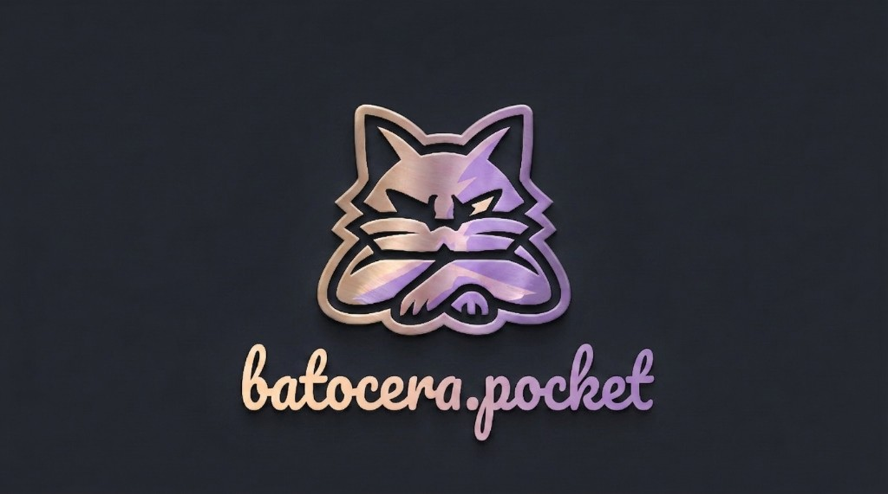

  

<h1 align="center">batocera.pocket</h1>

  
  
  
  

  Community <b>Batocera</b> images for <b>Qualcomm Snapdragon</b> handhelds — continuing the Qualcomm Batocera work started by <b>suckbluefrog</b>.

Built on [Batocera.linux](https://batocera.org/) / [Buildroot](https://buildroot.org/). On top of the normal Batocera stack: Steam GamepadUI (SteamOS-style session via gamescope), FEX with a Fedora rootfs squashfs for x86_64 Proton/Windows titles, and LXC desktops where the board supports them.

---

### ⚠️ Important Note on Bootloader
This Batocera build **requires** the [ROCKNIX ABL](https://github.com/ROCKNIX/abl). Make sure your device's boot partition is updated with the ROCKNIX ABL before flashing this image.

---

## Devices & builds

Images are per SoC. Every build ships the full Batocera stack (RetroArch cores, Wine/Proton tooling, etc.); the lists below highlight the headline ports and extras.

> **Testing status** — only the **AYN Odin 3 (SM8750)** is smoke-tested on this tree. The **SM8550** and **SM8250** images are **community / untested**: flash at your own risk and please report back.

### SM8750 — `batocera-sm8750` &nbsp;·&nbsp; ✅ Smoke-tested

| Device | Status |
|--------|--------|
| AYN Odin 3 | ✅ Tested |

<b>Emulators &amp; extras</b>

- Steam (GamepadUI / gamescope)
- FEX + Fedora squashfs
- Arch Plasma LXC · Ubuntu Plasma LXC
- Lutris
- Eden · Yuzu · Ryujinx
- Dolphin · RPCS3
- shadPS4 (FEX)
- AetherSX2 / ARMSX2 · PCSX2 · Play!
- Cemu · Vita3K · Xemu
- Xenia Canary / Edge
- *+ the rest of the Batocera set for this board*

**Not included:** Waydroid (disabled on Odin 3 / SM8750)

### SM8550 — `batocera-sm8550` &nbsp;·&nbsp; ⚠️ Untested

**Devices:** AYN Odin 2 / Mini / Portal · AYN Thor · AYANEO Pocket ACE / DS / DMG / EVO / S2K · Retroid Pocket 6 (+ TOP-DPAD DTB).

> No SM8550 hardware is available to the maintainer, so this image is **untested**. Deep sleep (S2RAM) is intentionally left off; the board uses the working s2idle path.

<b>Emulators &amp; extras</b>

- Steam (GamepadUI / gamescope)
- FEX + Fedora squashfs
- Arch Plasma LXC · Ubuntu Plasma LXC
- Lutris · Waydroid
- Eden · Yuzu · Ryujinx
- Dolphin · RPCS3
- shadPS4 (FEX)
- AetherSX2 / ARMSX2 · PCSX2 · Play!
- Cemu · Vita3K · Xemu
- Xenia Canary / Edge
- *+ the rest of the Batocera set for this board*

### SM8250 — `batocera-sm8250` &nbsp;·&nbsp; ⚠️ Untested

**Devices:** Retroid Pocket 5 · Mini · Mini V2 · Flip 2.

> No SM8250 hardware is available to the maintainer, so this image is **untested**. Flash at your own risk and please report back.

<b>Emulators &amp; extras</b>

- Steam (GamepadUI / gamescope)
- FEX + Fedora squashfs
- Eden · Yuzu · Ryujinx
- Dolphin · RPCS3
- AetherSX2 / ARMSX2
- Cemu · Vita3K · Xemu
- Xenia Edge
- *+ the rest of the Batocera set for this board*

**Not included:** Waydroid · Arch / Ubuntu Plasma LXC · Lutris · shadPS4 · PCSX2 / Play!

### Other (best-effort)

AYN Odin 1 (SD845), Radxa Dragon Q6A (QCS6490) — in-tree, not a focus of current builds.

---

## Preview

In-device footage ([@lukemotionYT](https://www.youtube.com/@lukemotionYT)) — performance examples, no commentary required:

  
  
  

---

## What's new — August 2026

Clean reflash baselines (see *Download & flash*). Per-board GitHub tags so OTA only matches the device SoC:

| Tag | Board | Status |
|-----|--------|--------|
| `v44-sm8750-20260809` | SM8750 (Odin 3) | ✅ Tested |
| `v44-sm8550-20260809` | SM8550 | ⚠️ Untested |
| `v44-sm8250-20260810` | SM8250 | ⚠️ Untested |

**Fan control**
- Fixed the automatic fan **not starting at boot** (it could get stuck at a stale manual PWM). The auto curve now comes up on its own every boot.
- New selectable **fan modes** in the Batocera Control Deck (**Home + A → Fan Mode**): **Silent**, **Auto**, **Aggressive**, **Off**.
- Fan mode / speed now **persists across reboots**.
- Gentler default curve: quiet under normal emulation, ramps hard only near the thermal ceiling.

**Performance / thermals**
- Default CPU governor is now **`ondemand`** on Qualcomm boards (scales down properly at idle → lower idle temps and heat). The *Balanced* power profile respects this instead of forcing `schedutil`.

**Updates (OTA)**
- Fixed the updater offering an **older** build as an "update" (no more false *update available* popup for a build you already surpass).
- Per-board release tags (`v44-<soc>-YYYYMMDD`) — devices only see updates for their SoC.
- Per-board release resolution hardened (fixes an issue that could blind the device to updates).

**Desktop / apps**
- **UI scaling** for the Apps/Tools configuration windows and the Arch/Ubuntu Plasma LXC desktops, so they're usable with mouse/touch on the handheld screen (sharp 1080p framebuffer, scaled UI).

**Wine**
- `wine` / `wine64` runner normalization + WoW64 fallback for modern unified Wine builds.

**Input**
- More robust **Force quit** (`L1 + R1 + Select + Start`) — cleanly tears down emulators, including Wine.

---
## First launch & hotkeys

The first start of **Steam** and of the **Arch / Ubuntu Plasma LXC** containers can take a while (downloads, rootfs setup, first boot). That is normal — let them finish.

**Container Initialization:** When first time running containers, switch to keyboard mode and press the `Enter` key repeatedly to progress through initialization.

| Combo | Action |
|-------|--------|
| **Home + A** | Batocera menu (utilities) |
| **Home + B** | Emulator / Steam options menu (Decky and related tools) |
| **Home + Touch** | Toggle on-screen keyboard |
| **Home + Select + Start** | Toggle built-in mouse |
| **L1 + R1 + Select + Start** | Force quit and return to Batocera |

**Home** can be remapped; it uses Batocera’s standard hotkey mapping.

---

## Extras

- [decky-bcc](https://github.com/darkplace/decky-bcc) — Decky Loader install helper for Steam

---

## Download & flash

1. Open [Releases](https://github.com/darkplace/batocera.pocket/releases) and pick the tag for **your SoC** (`v44-sm8750-…`, `v44-sm8550-…`, or `v44-sm8250-…`). Do not install another board’s image.
2. Download every volume for that release (`.zip` + `.z01`, `.z02`, …). Keep them in the same folder; do not rename.
3. Extract the `.zip` with 7-Zip or WinZip → one `.img.gz`.
4. Write that `.img.gz` to a microSD with balenaEtcher, Rufus, or Raspberry Pi Imager.

Boot from the card on the device (same flow as other Batocera Qualcomm builds). Later OTAs use the same per-board tags — a device only sees updates for its SoC.

---

## Support

Bugs and feedback: **@lukemotion** on Discord (device + image version + logs under `/userdata/system/logs/` help a lot).

---

## Credits

- Batocera groundwork: [suckbluefrog](https://github.com/suckbluefrog)
- Upstream: [Batocera.linux](https://batocera.org/)
- ABL (Bootloader): [ROCKNIX](https://rocknix.org/)

## License

batocera.pocket is licensed under the **GNU General Public License v2.0 (GPLv2)**, same as [Batocera.linux](https://github.com/batocera-linux/batocera.linux). See [LICENSE](LICENSE) for the full text. Individual packages may carry additional licenses; see each package directory.
